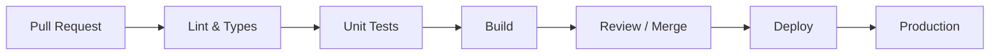

# Estándar de documentación CI/CD

Skill global de referencia. Complementa las skills `documentation`, `runbook` y `mermaid-diagrams`. La regla `ci-cd-documentation` (alwaysApply) resume las obligaciones; este fichero contiene plantillas y checklists.

## Cuándo usar

- Arranque de `docs/ci/` en un repo nuevo.
- Revisión de PR que modifica CI/CD o documentación operativa.
- Incidente recurrente sin runbook.
- Onboarding: «¿qué pasa cuando hago push?»

## Estructura obligatoria del repositorio

```
docs/ci/
  README.md                 # índice + audiencias
  recipes/
    developer-push-flow.md  # flujo dev (80 % preguntas diarias)
    sre-rollback.md         # ejemplo SRE
  runbooks/
    <incidente>.md
  diagrams/
    pipeline-overview.mmd   # o .md con bloque mermaid
```

En `docs/ci/README.md` incluir tabla:

| Documento | Audiencia | Cuándo leerlo |
|-----------|-----------|---------------|
| `recipes/developer-push-flow.md` | Desarrollador | Primer día / dudas de PR |
| `recipes/sre-rollback.md` | SRE / on-call | Deploy fallido |
| `diagrams/pipeline-overview` | Todos | Visión del flujo |
| `runbooks/*` | On-call | Alerta o fallo conocido |

## 1. Documentar pensando en el usuario final

### Recetas (recipe-based)

- Título: **Cómo …** (acción concreta).
- Máximo ~1 pantalla; enlazar profundidad en runbooks o ADRs.
- Incluir prerequisitos, pasos numerados, resultado esperado y «si falla, ver …».

**Plantilla — desarrollador (`recipes/developer-push-flow.md`):**

```markdown
# Cómo fluye mi commit hasta producción

## Resumen en 30 segundos
[1–3 frases]

## Disparadores
- Push a `main` → …
- Pull request → …

## Quality gates (orden)
1. Lint / typecheck
2. Tests
3. Build
4. …

## Dónde ver el estado
- Checks del PR: [enlace o ruta]
- Logs: …

## Si algo falla
→ [runbook o recipe enlazada]
```

**Plantilla — SRE (`recipes/sre-rollback.md`):**

```markdown
# Cómo hacer rollback de [servicio]

## Cuándo usar
## Prerrequisitos (accesos, CLI)
## Procedimiento
1. …
## Verificación post-rollback
## Escalado
```

### Documentación por stakeholder

| Rol | Necesita | No necesita en la receta |
|-----|----------|---------------------------|
| Dev | push → gates → merge → deploy | Detalle de infra interna |
| SRE | rollback, logs, dashboards, SLO | Tutorial de Git básico |

## 2. Pipeline-as-code (documentación inline)

Al editar `.github/workflows/*.yml`, GitLab CI, Azure Pipelines, etc.:

```yaml
# Por qué: el smoke tarda ~4 min en cold start; 3 min provoca falsos negativos en PR.
timeout-minutes: 8

jobs:
  quality:
    name: Quality gates (lint, types, unit tests)  # legible en logs
    steps:
      - name: Typecheck (tsc --noEmit)
```

**Reglas:**

- Comentar **porqué** (límites, `if:`, secrets, matrices), no repetir el nombre del step.
- `name:` de job y step = frase que un humano entienda en el log de CI.
- Si se elimina un step, actualizar `docs/ci/diagrams/` y la receta dev en el mismo PR.

## 3. Arquitectura visual y actualizable

- Diagramas en **Mermaid** (texto en repo). Usar skill `mermaid-diagrams`.
- Prohibido como única fuente: capturas PNG en wiki sin fuente editable.
- Ubicación: `docs/ci/diagrams/pipeline-overview.mmd` o sección en `README.md`.

**Ejemplo mínimo (`pipeline-overview.mmd`):**



Actualizar el diagrama en el **mismo PR** que cambie stages o entornos.

## 4. Runbooks de incidentes

Usar skill `runbook` para formato. Ubicación: `docs/ci/runbooks/<nombre>.md`.

**Plantilla:**

````markdown
# Runbook: [fallo típico]

**Owner:** [equipo] | **Última revisión:** YYYY-MM-DD | **Severidad si no se mitiga:** …

## Síntomas
## Diagnóstico rápido
## Pasos de mitigación
1. …
## Rollback
```bash
# comandos exactos
```
## Logs y dashboards
- …
## Escalado
````

Cubrir al menos: migración DB fallida, timeout de deploy, tests flaky, secretos/vars de CI.

## 5. Estandarizar y centralizar

- **Una fuente canónica** por equipo (`docs/ci/` en el repo de la app o monorepo de plataforma).
- **Plantillas:** copiar `docs/ci/` desde repo de referencia o scaffold en nuevo microservicio.
- **Trazabilidad:** cambios de pipeline ↔ PR ↔ actualización de diagrama y receta.

## Checklist de revisión (PR o auditoría)

- [ ] Existe `docs/ci/README.md` con índice por audiencia.
- [ ] Receta dev describe push/PR → producción.
- [ ] Workflows tienen `name:` legibles y comentarios de *why* donde no sea obvio.
- [ ] Diagrama Mermaid alineado con el pipeline actual.
- [ ] Runbook para fallos recurrentes del servicio (o issue de seguimiento).
- [ ] Mismo PR actualiza código + docs + diagrama cuando cambia CI/CD.

## Integración con otras skills

| Necesidad | Skill |
|-----------|--------|
| Redacción README/API/onboarding | `documentation` |
| Runbook operativo detallado | `runbook` |
| Sintaxis y tipo de diagrama | `mermaid-diagrams` |
| Implementar gates en YAML | `ci-cd-and-automation` (si está instalada) |
| Decisiones de arquitectura de entrega | `documentation-and-adrs` (si está instalada) |

## Idioma

Documentación para humanos en **español** salvo convención del repo (mensajes de herramientas, identificadores YAML).
