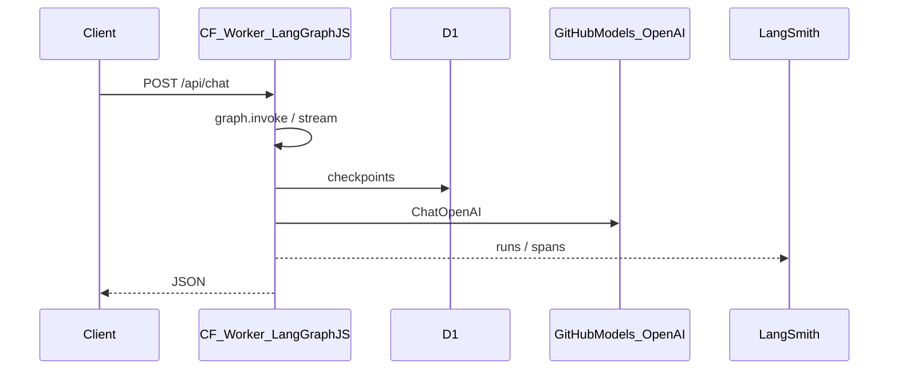

# Plan: LangSmith + este Worker (Cloudflare)

Integración de **LangSmith** para depuración, monitorización y trazas del agente **LangGraph.js** desplegado como Cloudflare Worker (este repo).

Contexto del ecosistema: [PROJECT-OVERVIEW.md](PROJECT-OVERVIEW.md).

## Alcance

- **Implementación en este repo:** Worker serverless, **LangGraph.js**, **D1**, `@langchain/openai`, rutas `POST /api/chat` y resume HITL.
- **Fuera de alcance:** el repo de referencia Python (`ia-agent-mvp` / FastAPI en contenedor); solo sirve para comparar comportamiento.

## Arquitectura objetivo

La orquestación corre **en el Worker**; LangSmith recibe trazas desde el mismo isolate.

## Diseño

### 1) Dependencias (npm)

Añadir **`langsmith`** al `package.json` (p. ej. `^0.3.0`, alineado con `@langchain/core` / `@langchain/langgraph` del proyecto).

### 2) Variables de entorno en Cloudflare

En **`wrangler.toml`** / dashboard:

| Variable | Notas |
|----------|--------|
| `LANGSMITH_TRACING` | `true` |
| `LANGSMITH_API_KEY` | Secreto: `wrangler secret put LANGSMITH_API_KEY` |
| `LANGSMITH_PROJECT` | Nombre del proyecto en LangSmith (puede ir en `[vars]`) |

Si la versión instalada documenta `LANGCHAIN_TRACING_V2` / `LANGCHAIN_API_KEY`, unificar con el esquema `LANGSMITH_*` vigente para no duplicar claves.

### 3) Código del Worker

Donde se invoque el grafo (`invoke`, `stream`, etc.), pasar en el config **`metadata`** y opcionalmente **`tags`**:

- `thread_id` (coherente con D1 / cliente demo)
- `operation`: `chat` vs `resume` (HITL)
- `deployment`: `production` / `preview` si aplica

La forma exacta del config depende de la versión de **LangGraph.js**; seguir la documentación oficial LangGraph JS + LangSmith para esa versión.

### 4) Compatibilidad Workers

- HTTPS saliente hacia la API de LangSmith debe estar permitido.
- Si el SDK asume solo Node, revisar soporte edge / `fetch` en Workers.

### 5) CI/CD

Opcional: propagar `LANGSMITH_API_KEY` en el workflow de deploy (como otros secretos), o documentar `secret put` manual.

### 6) Verificación

- Tras deploy: petición desde la landing `/demo` o `curl` al Worker → **runs** en LangSmith con `thread_id` en metadata.
- Probar **resume** tras interrupt para validar trazas de HITL.

### 7) Privacidad

Los contenidos de chat y herramientas se envían a LangSmith según el proyecto elegido; usar un proyecto dedicado para demos.

## Tareas de implementación

1. Añadir dependencia `langsmith` y actualizar lockfile.
2. Definir vars/secrets en Wrangler + nota en README.
3. En la invocación del grafo: `metadata` / `tags` (`thread_id`, `operation`, …).
4. Validar en la UI de LangSmith tras deploy a preview/staging.
5. (Opcional) Paso CI para `LANGSMITH_API_KEY`.
